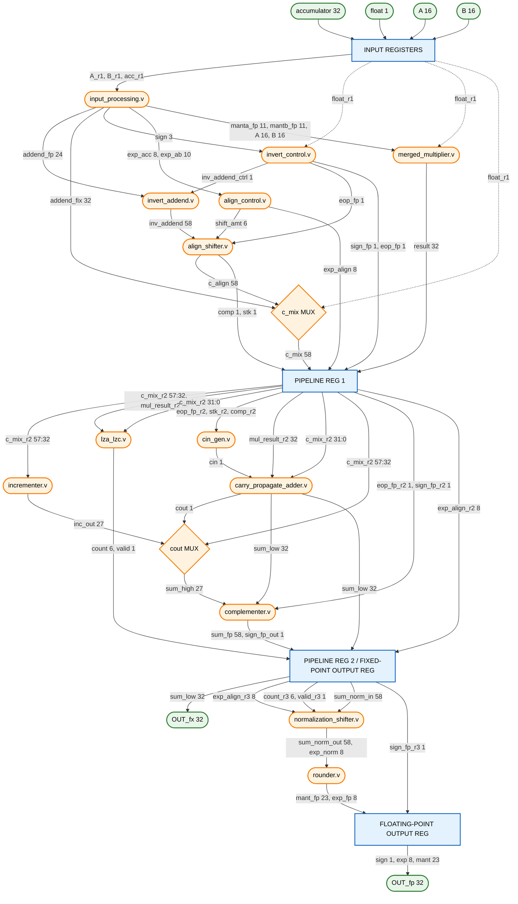

# Efficient Fixed/Floating-Point Merged MAC Architecture

Block diagram of the 3-stage pipelined, mixed-precision multiply-accumulate unit precisely mapped to the verified Verilog structural modules and exact signal widths.

Preview in VS Code or any Markdown viewer that supports Mermaid.



---

## Signal Glossary

| Signal | Width | Stage | Description |
|---|---|---|---|
| `eop_fp` | 1 | 1 | Effective operation: 1 = subtract (sign_p ≠ sign_acc), 0 = add |
| `inv_addend_ctrl` | 1 | 1 | = eop_fp; selects bitwise inversion of addend_fp in invert_addend |
| `inv_addend` | 58 | 1 | Inverted or straight 58-bit accumulator field from invert_addend |
| `shift_amt` | 6 | 1 | Right-shift to align accumulator: `ea + eb + 134 − ec`, clamped [0,57] |
| `exp_align` | 8 | 1→3 | Exponent of bit 57 of the 58-bit field: `(ea+eb+134) & 0xFF` |
| `c_mix` | 58 | 1 | FLP: aligned (possibly inverted) accumulator; FIX: zero-padded `addend_fix` |
| `comp` | 1 | 1 | Fill-with-ones flag from align_shifter (shift_amt > 35) |
| `stk` | 1 | 1 | Sticky bit: OR of all bits shifted out of the 58-bit window |
| `result` | 32 | 1 | Multiplier output: 32-bit product from merged_multiplier |
| `cin` | 1 | 2 | Carry-in to CPA: `= eop_fp` (completes ones-complement addition) |
| `sum_high` | 27 | 2 | Upper 27 bits of 58-bit sum: `cout ? inc_out : {1'b0, c_mix_r2[57:32]}` |
| `is_neg` | 1 | 2 | `eop_fp & ~sum_high[26]`: subtraction with negative result → negate |
| `sign_fp_out` | 1 | 2 | Result sign: `is_neg ? ~sign_fp : sign_fp` |
| `sum_fp` | 58 | 2 | Post-complement 58-bit sum (pass-through or 2's-complement negated) |
| `count` | 6 | 2 | LZA predicted shift (F-string, parallel with CPA); passed to Stage 3 |
| `actual_shift` | 6 | 3 | Exact LZC of `sum_norm_in` (ascending loop, highest set bit wins) |
| `sum_norm_out` | 58 | 3 | Left-shifted normalized mantissa |
| `exp_norm` | 8 | 3 | `exp_align − actual_shift` |

---

## Key Design Notes

**Karatsuba split** — FP16 11-bit mantissa: `mah = mant[10:8]` (3 bits), `mal = mant[7:0]` (8 bits). Product = `mal·mbl + mah·mbh·2^16 + cross·2^8`. The cross term uses the same `mult8` hardware that handles INT8 in FIX mode.

**58-bit accumulation field layout**
```
 bit 57                              bit 0
  |← accumulator mantissa (24b) →|            |← product (22b) →|
  [57:34]                                      [21:0]
  ↑ MSB of acc lands at 57 − shift_amt
```

**Ones-complement subtraction** — When `eop_fp=1`, the accumulator mantissa is bit-inverted by `invert_addend` and the lower 34 bits of `c_align` are filled with 1s. `cin=eop_fp=1` completes the two's complement across the CPA boundary. If `sum_high[26]` is not set (no end-around carry), the result is negative and `complementer` performs a true 2's-complement negation.

**Exact LZC in normalization** — `normalization_shifter` performs an exact ascending-loop LZC on the post-complement `sum_norm_in` for all cases. The `count`/`valid` ports forwarded from `lza_lzc` are connected but not used by the current implementation; they are retained for a future LZA-corrected normalisation path.

**Known defect — Karatsuba middle-term overflow** — The sums `X0+X1` and `Y0+Y1` are 9-bit values but truncated to 8 bits before the middle Booth multiplier. This corrupts the cross term for ~4.2% of normal FP16 operand pairs and is the root cause of the 47.1% FLP failure rate.
