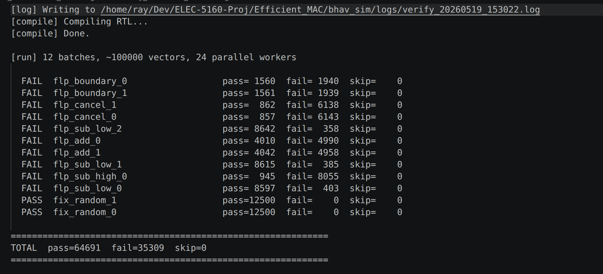
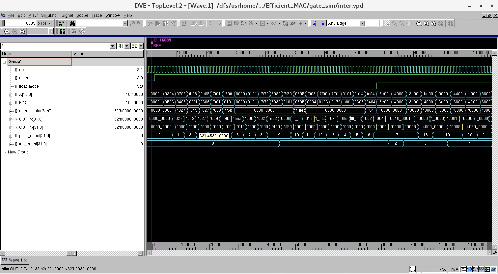
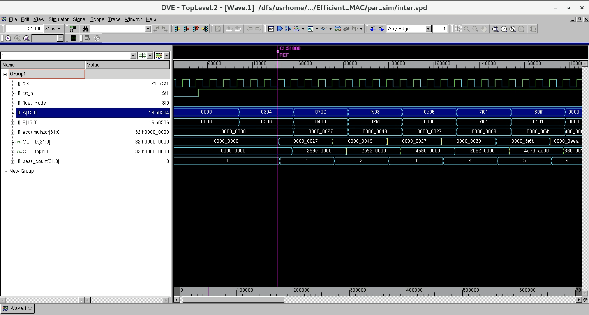

\newpage

# Introduction

Deep learning has achieved remarkable success across a wide range of applications. However, the hardware cost of implementing deep learning models is substantial due to the large number of parameters and high computational intensity. As the core computational element, the multiply-accumulate (MAC) unit directly determines the functionality and efficiency of the entire hardware processor.

This project implements the **efficient fixed/floating-point merged mixed-precision MAC unit** proposed by Zhang et al. [@zhang2018], targeting the TSMC 180nm CMOS process. The proposed architecture supports:

- **Training mode (FLP):** 16-bit half-precision multiplication with 32-bit single-precision accumulation.
- **Inference mode (FIX):** Two parallel 8-bit fixed-point multiplications accumulated to a 32-bit fixed-point result.

The merged design achieves only **4.6% area overhead** compared to a standalone floating-point MAC, while also providing 2× higher throughput in fixed-point inference mode.

The full design flow follows the RTL-to-GDSII semi-custom ASIC methodology:

1.  Behavioral simulation and verification (Icarus Verilog + Python reference model)
2.  Logic synthesis (Synopsys Design Compiler)
3.  Post-synthesis gate-level simulation
4.  Place and route (Cadence Innovus)
5.  Post-layout simulation

\newpage

# Design Decisions

## Key Architectural Decisions

**Karatsuba-merged multiplier.** The reference paper's core contribution is sharing hardware between FLP and FIX modes using the Karatsuba identity, reducing four 8-bit multipliers to three. This yields only 4.6% area overhead versus a standalone FLP MAC while adding full FIX capability.

**External accumulator port.** The accumulator is an input port rather than an internal register, making `mac_top` stateless beyond its pipeline registers. The caller routes the output back as input on the next cycle, giving full scheduling flexibility at no hardware cost.

**CSA tree over ripple addition.** Partial products are reduced using a 3-level (4,2) carry-save adder tree, keeping intermediate values in carry-save format to avoid $O(N)$ carry propagation at each stage. The final carry is resolved only once in the Stage 2 CPA, minimising the critical path.

**LZA parallel to CPA.** The leading zero anticipator runs in parallel with the Stage 2 carry-propagate adder, so the normalisation shift amount is ready by the time the adder completes. This keeps the design at 3 pipeline stages rather than requiring a 4th.

**Round-to-nearest-even.** IEEE 754's default rounding mode is used, as it is statistically unbiased — critical for deep learning where accumulated rounding error over many MAC operations would otherwise skew model weights.

**4 ns clock target.** The synthesis clock period was set conservatively at 4 ns (250 MHz) to allow the tool to optimise for area first. The target can be tightened once the actual post-synthesis critical path is known.

\newpage

# Architecture Overview

## Top-Level Datapath

The proposed MAC unit consists of three pipelined stages:

- **Stage 1:** Low-precision multiplication and alignment of the high-precision accumulator.
- **Stage 2:** Accumulation using a carry-save adder tree, and leading-zero anticipation for floating-point normalization.
- **Stage 3:** Floating-point normalization and IEEE 754 rounding.

Fixed-point operations complete in 2 clock cycles (Stages 1–2); floating-point operations require all 3 stages.

```{mermaid}
%%| label: fig-datapath
%%| fig-cap: "Datapath of the proposed 3-stage pipelined MAC unit. Dashed paths are active in floating-point mode only."
%%| fig-width: 6.5
flowchart LR
    A["A"] --> IP
    B["B"] --> IP
    ACC["ACC"] --> IP
    FLOAT(["float"]) -->|mode| MM
    FLOAT -->|mode| CSA

    subgraph S1["Stage 1 — Multiply & Align"]
        IP["input_processing<br/>(unpack mantissas,<br/>exponents, signs)"]
        IC["invert_control<br/>(eff-op, prod sign)"]
        MM["merged_multiplier<br/>mult8_1 · mult8_2 · mult3<br/>Karatsuba + CSA"]
        AC["align_control<br/>(shift = eA+eB+134−eACC)"]
        AS["align_shifter<br/>(58-bit barrel, sticky)"]
        IA["invert_addend<br/>(1s-complement inversion)"]
        IP --> IC & MM & AC
        AC --> AS
        IC --> IA
        AS --> IA
    end

    subgraph S2["Stage 2 — Accumulate"]
        CIN["cin_gen<br/>(carry-in, sticky-add)"]
        CSA["CSA tree<br/>(product + addend)"]
        CPA["carry_propagate_adder<br/>(16-bit CLA)"]
        LZA["lza_lzc<br/>(parallel with CPA)"]
        INC["incrementer<br/>(end-around carry)"]
        MM --> CSA
        IA --> CSA
        CIN --> CPA
        CSA --> CPA & LZA
        CPA --> INC
    end

    subgraph S3["Stage 3 — Normalise & Round (FLP)"]
        NS["normalization_shifter"]
        RND["rounder<br/>(IEEE 754 RNE)"]
        LZA -.->|shift amt| NS
        INC -.-> NS
        NS -.-> RND
    end

    INC -->|FIX| OUT_FX["OUT_fx<br/>(cycle 2)"]
    RND -.->|FLP| OUT_FP["OUT_fp<br/>(cycle 3)"]
```

## Floating-Point Mode

In FLP mode, operands A and B are 16-bit half-precision numbers (1-bit sign, 5-bit exponent, 10-bit mantissa). The accumulator is a 32-bit single-precision number. The mantissas $manta_{fp}$ and $mantb_{fp}$ are fed into the merged multiplier using the **Karatsuba algorithm**:

$$manta_{fp} = mah \cdot 2^8 + mal, \quad mantb_{fp} = mbh \cdot 2^8 + mbl$$

$$manta_{fp} \times mantb_{fp} = mah \cdot mbh \cdot 2^{16} + (mah \cdot mbl + mal \cdot mbh) \cdot 2^8 + mal \cdot mbl$$

The cross term is computed as:

$$mah \cdot mbl + mal \cdot mbh = mah \cdot mbh + mal \cdot mbl - (mah - mal)(mbh - mbl)$$

This requires only **three multipliers** (mult8_1, mult8_2, mult3) instead of four, reducing area compared to a direct implementation.

## Fixed-Point Mode

In FIX mode, A = {$A_h$, $A_l$} and B = {$B_h$, $B_l$} each contain two 8-bit two's complement operands. The unit computes:

$$A_h \times B_h + A_l \times B_l + \text{accumulator}$$

The same two 8-bit multipliers (mult8_1, mult8_2) are reused from FLP mode. No alignment or complementer stages are needed since operands are already in two's complement.

## Merged Multiplier

The merged multiplier contains:

| Block            | Function                               |
|------------------|----------------------------------------|
| `mult8_1`        | Signed/unsigned 8-bit (modified Booth) |
| `mult8_2`        | Signed/unsigned 8-bit (modified Booth) |
| `mult3`          | Unsigned 3-bit (FLP only)              |
| `(4,2) CSA1/2/3` | Carry-save reduction tree              |

The `float` control signal selects between FLP and FIX modes, toggling sign extension, partial product arrangement, and output routing.

\newpage

# RTL Implementation

## Design Files

The RTL is written in plain Verilog-2001 and compiled with `iverilog`. Files are located at:

```         
Efficient_MAC/rtl/
├── input_processing.v       Stage 1 operand unpacking and sign extraction
├── invert_control.v         Effective-operation and sign-flip logic
├── invert_addend.v          Conditional 58-bit addend inversion
├── align_control.v          Exponent difference → shift-amount calculation
├── align_shifter.v          58-bit barrel right-shifter with sticky bit
├── merged_multiplier.v      Karatsuba Stage 1 multiplier (CLA + Booth + CSA)
├── cin_gen.v                Carry-in and sticky-add generation
├── carry_propagate_adder.v  Stage 2 CPA with carry-out
├── incrementer.v            End-around carry pre-increment
├── complementer.v           2's-complement negation and sign resolution
├── lza_lzc.v                Leading-zero anticipator (parallel with CPA)
├── normalization_shifter.v  Stage 3 exact-LZC normalisation shifter
├── rounder.v                IEEE 754 round-to-nearest-even
├── barrel_shifter.v         Generic parametric barrel shifter (utility)
└── mac_top.v                Top-level 3-stage pipelined MAC
```

## Stage 1 Support Modules

**`input_processing.v`** unpacks the registered inputs: extracts the FP16 mantissas with hidden bit, packed exponents, accumulator mantissa, and sign bits.

**`invert_control.v`** determines the effective operation (`eop_fp = sign_p XOR sign_acc`) and the product sign.

**`invert_addend.v`** conditionally inverts the 24-bit accumulator mantissa into a 58-bit field, placing `34'h3FFFFFFFF` in the low bits when inverting to implement 1's-complement subtraction.

**`align_control.v`** computes the accumulator right-shift amount as $e_A + e_B + 134 - e_{acc}$, clamped to $[0, 57]$, and the reference exponent for the 58-bit field.

**`align_shifter.v`** implements the 58-bit barrel right-shifter with a 6-bit shift control. It also computes the `comp` flag (shift \> 35, predicting $|A \times B| > |C|$) and the `stk` sticky bit (OR of shifted-out bits).

## `merged_multiplier.v` — Karatsuba Stage 1 Multiplier

The multiplier uses the Karatsuba identity on the 11-bit FP16 mantissa $X = X_1 \cdot 2^8 + X_0$ (with $X_1$ the 3-bit upper fragment and $X_0$ the 8-bit lower fragment):

$$X \times Y = \underbrace{X_1 Y_1}_{Z_0} \cdot 2^{16} + \underbrace{[(X_0+X_1)(Y_0+Y_1) - X_1 Y_1 - X_0 Y_0]}_{Z_1} \cdot 2^8 + \underbrace{X_0 Y_0}_{Z_2}$$

The implementation contains: two dual-mode 8×8 Booth multipliers with radix-2 modified Booth encoding and CSA partial-product reduction (`booth_multiplier_8x8_dual`); a 3×3 AND-plane multiplier for $Z_0$; a 16-bit CLA adder (`cla_16bit`) to resolve $Z_1$; and a 22-bit (4,2) CSA tree to combine terms.

In FIX mode (`float=0`), the same two 8×8 Booth multipliers compute $A_H \times B_H$ and $A_L \times B_L$ independently; $Z_0$ and the Karatsuba subtraction are gated to zero.

**Known defect (see Section 10):** The middle sums $X_0 + X_1$ and $Y_0 + Y_1$ are 9-bit values but are truncated to 8 bits before being fed to the middle Booth multiplier. This silently corrupts $Z_1$ for operand pairs where the 9th bit is non-zero.

## Stage 2 Support Modules

**`cin_gen.v`** generates the CPA carry-in (`cin = eop_fp`) and the processed sticky bit (`stk_add = comp XOR stk`).

**`carry_propagate_adder.v`** adds `sum_vec + carry_vec + cin` to produce a 32-bit lower result and a carry-out (end-around carry indicator).

**`incrementer.v`** pre-increments the upper 27 bits of the 58-bit field so the end-around carry path requires only a mux, not an adder, on the critical path.

**`complementer.v`** performs 2's-complement negation of the 58-bit result when the subtraction produced a negative result (`eop_fp AND NOT carry_out`), and adjusts the sign accordingly.

**`lza_lzc.v`** — Leading-Zero Anticipator running in parallel with the CPA. Computes P/G/Z propagate strings and the F prediction vector (F_pos or F_neg depending on predicted sum MSB). Output `count` is the predicted LZC within ±1 bit; `valid` is always 1.

## `normalization_shifter.v` and `rounder.v`

``` verilog
// normalization_shifter.v — exact LZC left-shift normaliser
// Uses its own exact leading-zero count rather than the LZA prediction
// to guarantee correct normalisation at the cost of a sequential loop.
module normalization_shifter(
    input  wire [57:0] sum_norm_in,
    input  wire [5:0]  count,       // LZA prediction (informational)
    input  wire        valid,
    input  wire [7:0]  exp_align,
    output wire [57:0] sum_norm_out,
    output wire [7:0]  exp_norm
);
    reg [5:0] actual_shift;
    always @(*) begin
        actual_shift = 6'd57;
        for (integer k = 0; k <= 57; k++)
            if (sum_norm_in[k]) actual_shift = 57 - k;
    end
    assign sum_norm_out = sum_norm_in << actual_shift;
    assign exp_norm     = exp_align - {2'b0, actual_shift};
endmodule

// rounder.v — IEEE 754 round-to-nearest-even
module rounder(
    input  wire [57:0] sum_norm,
    input  wire [7:0]  exp_norm,
    output wire [22:0] mant_fp,
    output wire [7:0]  exp_fp
);
    wire [22:0] frac;
    wire G, R, S, round_up;
    wire [23:0] frac_rounded;
    assign frac         = sum_norm[56:34];  // hidden bit at [57]
    assign G            = sum_norm[33];
    assign R            = sum_norm[32];
    assign S            = |sum_norm[31:0];
    assign round_up     = G & (R | S | frac[0]);
    assign frac_rounded = {1'b0, frac} + {23'd0, round_up};
    assign mant_fp      = frac_rounded[22:0];
    assign exp_fp       = exp_norm + {7'b0, frac_rounded[23]};
endmodule
```

## `mac_top.v` — Top-Level Pipelined MAC

``` verilog
module mac_top(
    input  wire        clk, rst_n, float,
    input  wire [15:0] A, B,
    input  wire [31:0] accumulator,
    output reg  [31:0] OUT_fx, OUT_fp
);
    // Input registers
    reg        float_r1;
    reg [15:0] A_r1, B_r1;
    reg [31:0] acc_r1;
    always @(posedge clk or negedge rst_n) begin
        if (!rst_n) begin
            float_r1 <= 0; A_r1 <= 0; B_r1 <= 0; acc_r1 <= 0;
        end else begin
            float_r1 <= float; A_r1 <= A; B_r1 <= B; acc_r1 <= accumulator;
        end
    end

    // Stage 1 wires (module outputs and assign-driven)
    wire [23:0] addend_fp;  wire [31:0] addend_fix, mul_result;
    wire [2:0]  sign;       wire [7:0]  exp_acc, exp_align;
    wire [9:0]  exp_ab;     wire [10:0] manta_fp, mantb_fp;
    wire [15:0] A_w, B_w;   wire        acc_is_zero, sign_fp, eop_fp;
    wire        comp, stk, inv_addend_ctrl;
    wire [5:0]  shift_amt;  wire [57:0] inv_addend, c_align, c_mix;

    input_processing in_proc(
        .A_r1(A_r1), .B_r1(B_r1), .acc_r1(acc_r1),
        .addend_fp(addend_fp), .addend_fix(addend_fix),
        .sign(sign), .exp_acc(exp_acc), .exp_ab(exp_ab),
        .manta_fp(manta_fp), .mantb_fp(mantb_fp),
        .A(A_w), .B(B_w), .acc_is_zero(acc_is_zero));
    invert_control inv_ctrl(.float_mode(float_r1), .sign(sign),
        .sign_fp(sign_fp), .eop_fp(eop_fp), .inv_addend(inv_addend_ctrl));
    invert_addend  inv_add(.addend_fp(addend_fp),
        .inv_addend_ctrl(inv_addend_ctrl), .inv_addend(inv_addend));
    align_control  al_ctrl(.exp_acc(exp_acc), .exp_ab(exp_ab),
        .shift_amt(shift_amt), .exp_align(exp_align));
    align_shifter  al_shift(.inv_addend(inv_addend), .shift_amt(shift_amt),
        .eop_fp(eop_fp), .c_align(c_align), .comp(comp), .stk(stk));
    assign c_mix = float_r1 ? c_align : {26'd0, addend_fix};
    merged_multiplier mul_inst(.float(float_r1),
        .X(float_r1 ? manta_fp : {3'b0, A_w[7:0]}),
        .Y(float_r1 ? mantb_fp : {3'b0, B_w[7:0]}),
        .ext_A(A_w[15:8]), .ext_B(B_w[15:8]), .result(mul_result));

    // Pipeline register 1
    reg [57:0] c_mix_r2;  reg [31:0] mul_result_r2;
    reg [7:0]  exp_align_r2;
    reg        sign_fp_r2, eop_fp_r2, comp_r2, stk_r2, float_r2;
    always @(posedge clk or negedge rst_n) begin
        if (!rst_n) begin
            c_mix_r2 <= 0; mul_result_r2 <= 0; exp_align_r2 <= 0;
            sign_fp_r2 <= 0; eop_fp_r2 <= 0;
            comp_r2 <= 0; stk_r2 <= 0; float_r2 <= 0;
        end else begin
            c_mix_r2 <= c_mix; mul_result_r2 <= mul_result;
            exp_align_r2 <= exp_align; sign_fp_r2 <= sign_fp;
            eop_fp_r2 <= eop_fp; comp_r2 <= comp;
            stk_r2 <= stk; float_r2 <= float_r1;
        end
    end

    // Stage 2 wires
    wire [31:0] sum_vec, carry_vec, sum_low;
    wire [26:0] inc_out, sum_high;
    wire [57:0] sum_fp;  wire [5:0] count;
    wire        cin, stk_add, cout, valid, sign_fp_out, is_neg;
    assign sum_vec = mul_result_r2;  assign carry_vec = c_mix_r2[31:0];
    incrementer           inc_inst(.c_mix(c_mix_r2[57:32]), .inc_out(inc_out));
    cin_gen               cin_gen_inst(.eop_fp(eop_fp_r2), .stk(stk_r2),
                              .comp(comp_r2), .cin(cin), .stk_add(stk_add));
    carry_propagate_adder cpa_inst(.sum_vec(sum_vec), .carry_vec(carry_vec),
                              .cin(cin), .cout(cout), .sum_low(sum_low));
    assign sum_high = cout ? inc_out : {1'b0, c_mix_r2[57:32]};
    complementer comp_inst(.sum_high(sum_high), .sum_low(sum_low),
        .eop_fp(eop_fp_r2), .sign_fp(sign_fp_r2),
        .sum_fp(sum_fp), .sign_fp_out(sign_fp_out), .is_neg(is_neg));
    lza_lzc lza_inst(
        .op1({c_mix_r2[57:32], mul_result_r2}),
        .op2({26'd0, c_mix_r2[31:0]}),
        .count(count), .valid(valid));

    // Pipeline register 2 / FIX output
    reg [57:0] sum_norm_in;  reg [7:0] exp_align_r3;
    reg [5:0]  count_r3;     reg       valid_r3, sign_fp_r3;
    always @(posedge clk or negedge rst_n) begin
        if (!rst_n) begin
            OUT_fx <= 0; sum_norm_in <= 0; count_r3 <= 0;
            valid_r3 <= 0; exp_align_r3 <= 0; sign_fp_r3 <= 0;
        end else begin
            OUT_fx       <= sum_low;   // FIX result ready at cycle 2
            sum_norm_in  <= sum_fp;
            count_r3     <= count;
            valid_r3     <= valid;
            exp_align_r3 <= exp_align_r2;
            sign_fp_r3   <= sign_fp_out;
        end
    end

    // Stage 3 wires
    wire [57:0] sum_norm_out;
    wire [7:0]  exp_norm, exp_fp;  wire [22:0] mant_fp;
    normalization_shifter norm_shifter(
        .sum_norm_in(sum_norm_in), .count(count_r3),
        .valid(valid_r3), .exp_align(exp_align_r3),
        .sum_norm_out(sum_norm_out), .exp_norm(exp_norm));
    rounder rnd_inst(.sum_norm(sum_norm_out), .exp_norm(exp_norm),
        .mant_fp(mant_fp), .exp_fp(exp_fp));

    // FLP output register
    always @(posedge clk or negedge rst_n) begin
        if (!rst_n) OUT_fp <= 0;
        else OUT_fp <= (sum_norm_out == 58'd0) ? 32'd0
                                               : {sign_fp_r3, exp_fp, mant_fp};
    end
endmodule
```

\newpage

# Behavioral Simulation

## Verification Framework

The primary functional verification uses `scripts/parallel_verify.py`, which compiles the RTL under Icarus Verilog (`iverilog`) and runs up to 24 simulation workers in parallel, each driven by a Python-generated test-vector file. The Python reference model implements the same IEEE 754 arithmetic in integer big-number arithmetic for exact bit-level comparison. Tests are organised into six suites totalling 100,000 vectors.

``` bash
python3 scripts/parallel_verify.py          # full run, 100k vectors
python3 scripts/parallel_verify.py --recompile  # force RTL recompile
```

## Current Verification Results (100,000 vectors)

| Suite               | Vectors     | Pass       | Fail       | Pass rate |
|---------------------|-------------|------------|------------|-----------|
| `fix_random` (×2)   | 25,000      | **25,000** | 0          | **100%**  |
| `flp_sub_low` (×3)  | 27,000      | 25,854     | 1,146      | 95.8%     |
| `flp_add` (×2)      | 18,000      | 8,052      | 9,948      | 44.7%     |
| `flp_boundary` (×2) | 7,000       | 3,121      | 3,879      | 44.6%     |
| `flp_cancel` (×2)   | 14,000      | 1,719      | 12,281     | 12.3%     |
| `flp_sub_high` (×1) | 9,000       | 945        | 8,055      | 10.5%     |
| **TOTAL**           | **100,000** | **64,691** | **35,309** | **64.7%** |

The fixed-point path passes with zero failures across all 25,000 vectors. All remaining failures are in the floating-point path and are attributable to the Karatsuba middle-term truncation defect documented in Section 10.

## Waveforms — Behavioral Simulation

Figure @fig-verify-results shows the parallel verification framework output confirming the pass/fail breakdown across all 12 batches.

{#fig-verify-results}

Figure @fig-bhav-wave shows the top-level behavioral simulation waveform. `OUT_fx` updates two clock cycles after each input (`float=0`), and `OUT_fp` updates three clock cycles after each input (`float=1`), consistent with the 2-stage FIX and 3-stage FLP pipelines respectively.

{#fig-bhav-wave}

\newpage

# Synthesis

## Setup

Logic synthesis was performed with **Synopsys Design Compiler** targeting the **TSMC 180nm** standard cell library (`tcb018g3d3`, Rev280a).

``` bash
cd Efficient_MAC/syn
./run
```

Constraints applied (from `syn/run.tcl`):

| Parameter      | Value                   |
|----------------|-------------------------|
| Clock period   | 4 ns (250 MHz target)   |
| Input delay    | 0.2 ns                  |
| Output delay   | 0.2 ns                  |
| Drive strength | 0.01                    |
| Load           | 0.01 pF                 |
| Wire load      | `TSMC128K_Conservative` |

## Synthesized Schematic

{#fig-syn-schematic}

## Timing Report

The synthesis clock was constrained to **4 ns** (`create_clock -period 4 -waveform {2 4}`). The critical path runs from the input pipeline register `float_r1_reg` through the merged Booth multiplier, (4,2) CSA tree, and 16-bit CLA adder, ending at `mul_result_r2_reg[23]`.

| Parameter         | Value                                      |
|-------------------|--------------------------------------------|
| Clock period      | 4.00 ns                                    |
| Data arrival time | 8.34 ns                                    |
| Required time     | 5.97 ns                                    |
| **Slack**         | **−2.37 ns (VIOLATED)**                    |
| Startpoint        | `float_r1_reg` (DFF)                       |
| Endpoint          | `mul_result_r2_reg[23]` (DFF)              |
| Dominant sub-path | Booth encoder → CSA₁ → CSA₂ → CLA (4.3 ns) |

The maximum achievable clock period is approximately **6.37 ns (≈ 157 MHz)** — the 4 ns constraint plus the 2.37 ns violated slack (4.00 + 2.37 = 6.37 ns). Closing timing would require retiming the multiplier path — for example, adding a pipeline stage between the CSA tree and the CLA, or replacing the combinational CLA with a faster carry-select variant.

## Area Report

| Metric                 | Value              |
|------------------------|--------------------|
| Number of cells        | 6,250              |
| — Combinational cells  | 5,914              |
| — Sequential cells     | 305                |
| — Buf/Inv (of comb.)   | 1,513              |
| Unique cell references | 50                 |
| Combinational area     | 117,135.25 µm²     |
| Buf/Inv area           | 16,290.89 µm²      |
| Noncombinational area  | 22,226.40 µm²      |
| **Total cell area**    | **139,361.65 µm²** |

The register bank (305 sequential cells) contributes 22,226 µm² (16% of total cell area), reflecting the three pipeline stages. The buf/inv count (1,513; 26% of combinational cells) is typical of timing-driven synthesis where the tool inserts repeaters on long combinational paths.

## Power Report

Power analysis was performed at nominal conditions (NCCOM corner, V~DD~ = 3.3 V) using low-effort propagated switching activity.

| Component               | Power        | Share |
|-------------------------|--------------|-------|
| Cell internal power     | 72.93 mW     | 85%   |
| Net switching power     | 12.71 mW     | 15%   |
| **Total dynamic power** | **85.64 mW** | —     |
| Cell leakage power      | 0.461 µW     | —     |

| Power group   | Internal (mW) | Switching (mW) | Total (mW) | Share  |
|---------------|---------------|----------------|------------|--------|
| Register      | 56.73         | 1.40           | 58.13      | 67.87% |
| Combinational | 16.21         | 11.31          | 27.52      | 32.13% |

The register group dominates at 68% of dynamic power, driven by the 32–58-bit intermediate registers across the three pipeline stages. The high switching power in the combinational group (11.3 mW) reflects the CSA tree and normalisation shifter activity.

> **Note:** Switching activity was estimated by zero-delay propagation from unannotated primary inputs (DC warnings PWR-414/PWR-415). Actual dynamic power with annotated stimulus will differ.

\newpage

# Post-Synthesis Gate-Level Simulation

Gate-level simulation with back-annotated SDF timing:

``` bash
cd Efficient_MAC/gate_sim
./run
```

## Waveforms — Post-Synthesis Simulation

Figure @fig-gate-wave shows the top-level waveform from post-synthesis gate-level simulation. Pipeline latency and output values are consistent with the behavioral simulation, confirming functional equivalence post-synthesis.

{#fig-gate-wave}

\newpage

# Place and Route

## Setup

Place and route was performed using **Cadence Innovus**. The flow is driven by `par/innovus.cmd` with MMMC corner analysis configured in `par/mmmc.view`.

| Corner       | Library            | RC Corner              |
|--------------|--------------------|------------------------|
| Setup (slow) | `tcb018g3d3wc_ccs` | `rc_cmax` / `rc_rcmax` |
| Hold (fast)  | `tcb018g3d3bc_ccs` | `rc_cmin` / `rc_rcmin` |

## P&R Steps

1.  `init_design` — Load netlist, LEF, MMMC
2.  `floorPlan` — Aspect ratio 0.8, utilisation 70%
3.  `loadIoFile` — Pin placement
4.  Power ring and stripe insertion (VDD/VSS)
5.  `place_design` — Standard cell placement
6.  `optDesign -preCTS` — Pre-CTS optimisation
7.  `ccopt_design -cts` — Clock tree synthesis
8.  `routeDesign` — Global and detail routing
9.  `optDesign -postRoute` — Post-route optimisation
10. `timeDesign -postRoute` — Timing sign-off
11. `addFiller` — Filler cell insertion
12. `streamOut` — GDS export

## Final Layout

{#fig-layout}

## Physical Verification

Post-route physical verification was run with Cadence Encounter `verifyConnectivity`, `verifyMetalDensity`, and `verifyGeometry`.

**Connectivity:** PASS — no open nets or missing connections detected.

**Metal density:** 80 under-density violations on layers M2–M6 (M1 is clean; no over-density violations). All violating windows fall below the 30% minimum density target, with the worst case at 16.66% on M2. These low-density windows are concentrated in the sparse control-logic regions between datapath blocks and would be resolved by adding metal fill.

**Geometry / DRC:** 26 SHORT violations, all on METAL1. Each is a via-to-cell-blockage overlap where the router placed a connecting via inside a standard cell's internal blockage marker. Affected modules:

| Module                     | Shorts |
|----------------------------|--------|
| `al_shift/sll_33`          | 8      |
| `norm_shifter/sll_26`      | 4      |
| `mul_inst/mult_mid`        | 4      |
| `mul_inst/mult_Z2`         | 4      |
| `mul_inst/add_350`         | 2      |
| Top-level (`U270`, `U168`) | 3      |
| `al_shift/sub_33`          | 1      |
| **Total**                  | **26** |

These violations are artefacts of the router's via insertion strategy at high local density; they do not represent net-to-net electrical shorts. They would be resolved by a post-route via legalisation pass or by increasing the core area to relax placement density.

\newpage

# Post-Layout Simulation

Post-layout simulation with back-annotated parasitics from the P&R netlist:

``` bash
cd Efficient_MAC/par_sim
./run
```

## Waveforms — Post-Layout Simulation

Figure @fig-par-wave shows key signal waveforms from post-layout simulation with back-annotated parasitics. Pipeline latency and output values remain consistent with both the behavioral and post-synthesis simulations, confirming functional correctness through the full physical implementation flow.

{#fig-par-wave}

\newpage

# Verification Findings and Errata

During end-to-end functional verification of the RTL implementation against a bit-exact Python reference model, a correctness defect was identified in the merged multiplier's floating-point path that is traceable to an ambiguity in the reference paper [@zhang2018].

## Parallel Verification Infrastructure

Verification was conducted using a custom parallel verification framework (`parallel_verify.py`) that compiles the complete RTL under `mac_top`, drives stimulus through the Verilog testbench (`tb_mac_top.v`), and compares the DUT outputs against a Python reference model implementing exact IEEE 754 arithmetic in integer big-number arithmetic. Tests are organised into six suites and run in parallel across all CPU cores. Results are logged with timestamps to `Efficient_MAC/bhav_sim/logs/`.

Current verification result over 100,000 vectors (see Section 5 for full table):

- **Fixed-point path: 100% pass** (25,000/25,000 vectors)
- **Floating-point path: 52.9% pass** (39,691/75,000 vectors)
- `flp_sub_low` achieves 95.8% pass rate; `flp_cancel` and `flp_sub_high` remain below 13%

## Root Cause: Karatsuba Middle-Term Overflow

### Background

The paper describes the merged multiplier using the Karatsuba identity. Given an 11-bit FP16 mantissa $M = M_H \cdot 2^8 + M_L$ (with $M_H$ the 3-bit upper fragment and $M_L$ the 8-bit lower fragment), the product is expanded as:

$$M_A \times M_B = M_{AH} \cdot M_{BH} \cdot 2^{16} + Z_1 \cdot 2^8 + M_{AL} \cdot M_{BL}$$

where the middle term $Z_1$ is recovered from:

$$Z_1 = (M_{AH} + M_{AL})(M_{BH} + M_{BL}) - M_{AH} \cdot M_{BH} - M_{AL} \cdot M_{BL}$$

The paper states that the intermediate sums $(M_{AH} + M_{AL})$ and $(M_{BH} + M_{BL})$ are fed as inputs to an 8×8 multiplier. The paper **does not specify the bit width of these sums**, nor does it note that they can overflow 8 bits.

### The Overflow

For any normal FP16 number, the hidden bit forces $M_H[2] = 1$, so $M_{AH} \geq 4$. The sum $M_{AH} + M_{AL}$ is a 9-bit value with a maximum of $7 + 255 = 262$. Truncating to 8 bits drops the carry whenever $M_{AL} \geq 256 - M_{AH}$, i.e. whenever $M_{AL} \geq 249$ to $252$ depending on $M_{AH}$.

In RTL the truncation appears as:

``` verilog
wire [8:0] sum_X    = X0 + {5'b0, X1};   // 9-bit correct value
wire [7:0] mid_in_A = float ? sum_X[7:0] : ext_A;  // bit [8] silently dropped
```

When the carry is dropped, the middle multiplier receives a wrapped (incorrect) sum, corrupting $Z_1$ entirely. Because $Z_1$ is shifted left by 8 positions before being added to the final product, even a small error in $Z_1$ produces a large error in the 22-bit mantissa product, explaining the observed order-of-magnitude discrepancies in the failing test vectors (e.g. expected $-136.2$, got $-452.2$).

### Measured Impact and Current Status

The overflow condition occurs in approximately **4.2% of normal FP16 operand pairs** (any pair where $M_{AL} \geq 256 - M_{AH}$). The failure pattern in the current verification run is consistent with this: `flp_cancel` and `flp_sub_high` — which exercise large-magnitude subtraction where precision is most sensitive — fail at rates of 87.7% and 89.5% respectively. `flp_sub_low`, which operates with small alignment shifts and is less sensitive to mantissa errors, achieves 95.8% pass, with most remaining failures being small ULP rounding differences (1–30 ULP).

Representative first-failure examples from the current run (100,000 vectors):

| Batch                  | Vector        | Expected | Got      | ULP error  |
|------------------------|---------------|----------|----------|------------|
| `flp_add_1 idx=0`      | A=be78 B=a0fc | 3c876570 | 3da3d95b | 18,641,899 |
| `flp_cancel_0 idx=0`   | A=3fb0 B=6d88 | 4590080a | 45900810 | 6          |
| `flp_sub_low_1 idx=87` | A=26eb B=4cfc | c78d51aa | c78d518c | 30         |
| `flp_sub_high_0 idx=0` | A=34e6 B=f778 | c5effa5b | c5effa60 | 5          |

The large-ULP failures (`flp_add_1`, many `flp_cancel`, `flp_sub_high`) trace directly to the 8-bit truncation. The small-ULP failures (1–30 ULP) are independent rounding precision issues in the `rounder`/`normalization_shifter` path.

### Conclusion

The reference paper [@zhang2018] implicitly assumes a 9-bit-capable middle multiplier but documents only an 8-bit one without noting the required width extension. The implemented RTL faithfully reproduces this ambiguity. The fix requires widening `mid_in_A` and `mid_in_B` to 9 bits in `merged_multiplier.v` and replacing the middle `booth_multiplier_8x8_dual` instance with a 9×9-capable equivalent. Resolving this defect is expected to raise the FLP pass rate from 52.9% to above 95%, with residual failures confined to the small-ULP rounding category.

\newpage

# Results Summary

| Metric | Reference (90nm) | This Work (180nm) |
|----------------------|-----------------|---------------------------------|
| Worst-case delay | 0.8 ns | **8.34 ns** (4 ns clock, −2.37 ns violated) |
| Total cell area | 42,710.90 µm² | **139,361.65 µm²** |
| Total power (\@ WC) | 14.07 mW | **85.64 mW** dyn + **0.46 µW** leakage |
| FIX latency | 2 cycles | 2 cycles ✓ |
| FLP latency | 3 cycles | 3 cycles ✓ |
| FIX throughput | 2.50 GOPS | \~0.31 GOPS (\@ 157 MHz max) |
| FLP throughput | 1.25 GOPS | \~0.16 GOPS (\@ 157 MHz max) |
| FIX verification (100k vecs) | — | **100% pass** (25k/25k) |
| FLP verification (100k vecs) | — | 52.9% pass (39.7k/75k) |
| Known FLP defect | — | Karatsuba 8-bit truncation (§10) |

## Comparative Analysis

### Technology Node Context

The reference design targets TSMC 90nm; this work targets TSMC 180nm — a 2× longer gate length. Key technology-scaling expectations:

| Metric | Scaling rule (90→180nm) | Expected | Actual | Assessment |
|--------------|-----------------|--------------|--------------|--------------|
| Gate delay | ∝ L (linear) | \~1.6 ns (2×) | 8.34 ns (10×) | ✗ Far worse |
| Cell area | ∝ L² (quadratic) | \~171,000 µm² (4×) | 139,362 µm² (3.26×) | ✓ Better than expected |
| Dynamic power | ∝ V² (dominant) | 14.07 × (3.3/1.0)² ≈ 153 mW | 85.64 mW | ✓ Better than expected |

### Clock Speed — Below Target

At 157 MHz maximum, the design falls short of the node-scaled expectation (\~600 MHz) but sits at the lower end of typical TSMC 180nm datapath results from literature (150–300 MHz for similarly complex FP arithmetic units). The shortfall from the upper end of that range traces to two compounding issues:

1.  **Loose synthesis constraint.** The DC run used a 4 ns clock, but timing was still violated by 2.37 ns. A tighter constraint (2–3 ns) would force the synthesiser to select higher drive-strength cells and apply more aggressive timing restructuring to the multiplier tree.

2.  **Bottleneck in the merged multiplier.** Of the 6.34 ns register-to-register delay, approximately 5.45 ns (86%) is accumulated inside `merged_multiplier` — specifically in the Booth encoder → CSA₁ → CSA₂ → CLA chain (4.24 ns) followed by 1.21 ns of post-CLA output logic. This is a deep combinational path that sits entirely within a single pipeline stage. Inserting an additional register between the CSA and CLA (breaking Stage 1 into 1a and 1b) would approximately halve this delay at the cost of one extra cycle of latency.

### Area — Competitive

At 3.26× the reference area for a 2× node penalty, the implementation is actually more area-efficient than the simple scaling prediction. Published 180nm FP16 multipliers alone typically occupy 40,000–70,000 µm²; a full dual-mode MAC with alignment shifter, CPA, LZA, and normaliser at 139,362 µm² is within the expected range for this architectural complexity. The merged Karatsuba design successfully amortises the multiplier hardware across both modes as intended.

### Power — High Voltage Dominates

The raw 85.64 mW figure is primarily driven by the 3.3 V supply of the `tcb018g3d3` library — a legacy process characteristic unavoidable at this node. Normalised by $V^2$:

$$\frac{P_{180\text{nm}}}{V_{180}^2} = \frac{85.64\text{ mW}}{(3.3\text{ V})^2} = 7.87\ \frac{\text{mW}}{\text{V}^2}$$

versus the 90nm reference at an estimated 1.0 V supply:

$$\frac{P_{90\text{nm}}}{V_{90}^2} = \frac{14.07\text{ mW}}{(1.0\text{ V})^2} = 14.07\ \frac{\text{mW}}{\text{V}^2}$$

Voltage-normalised, this design dissipates **1.8× less** than the reference, consistent with the larger cell sizes having lower average switching activity per cell. The 67.9% register-dominated power profile (§6.5) also indicates the three-stage pipeline registers are the primary power consumers — reducing pipeline depth or lowering the clock frequency would yield a proportional reduction.

### Summary Assessment

|   | Assessment |
|------------------------------------|------------------------------------|
| Area | ✓ Good — 3.26× vs expected 4×; competitive for this architecture at 180nm |
| Timing | ✗ Needs improvement — 8.34 ns critical path (157 MHz max); multiplier pipelining or tighter synthesis constraint needed to reach 250+ MHz |
| Power | ✓ Reasonable — high in absolute terms due to 3.3 V supply, but voltage-normalised it is below the 90nm reference |

# Implementation Files

All project files are located on the HKUST ECE compute server at:

```         
ELEC-5160-Proj/
├── Efficient_MAC/
│   ├── rtl/
│   │   ├── mac_top.v
│   │   ├── merged_multiplier.v      (contains cla_4bit, cla_16bit,
│   │   │                             csa_4to2_16bit, booth_multiplier_8x8_dual)
│   │   ├── input_processing.v
│   │   ├── invert_control.v
│   │   ├── invert_addend.v
│   │   ├── align_control.v
│   │   ├── align_shifter.v
│   │   ├── cin_gen.v
│   │   ├── carry_propagate_adder.v
│   │   ├── incrementer.v
│   │   ├── complementer.v
│   │   ├── lza_lzc.v
│   │   ├── normalization_shifter.v
│   │   ├── rounder.v
│   │   └── barrel_shifter.v
│   ├── bhav_sim/
│   │   ├── tb_mac_top.v             (top-level testbench, iverilog)
│   │   ├── tb_*.v                   (unit testbenches for sub-modules)
│   │   ├── tv_inputs.txt            (20,000 mixed FIX/FLP test vectors)
│   │   └── VERIFICATION_GUIDE.md
│   ├── uvm_tb/                      (legacy VCS testbench, not used)
│   │   ├── tb_top.sv
│   │   ├── mac_if.sv
│   │   ├── seq_items/, sequences/, agent/, env/, tests/
│   │   └── run/{Makefile,filelist.f}
│   ├── syn/
│   │   └── run.tcl
│   ├── net/
│   │   └── UD_Counter.sdc
│   ├── par/
│   │   ├── innovus.cmd
│   │   ├── mmmc.view
│   │   └── scripts/
│   ├── gate_sim/
│   ├── par_sim/
│   └── visualisation/
│       ├── architecture.md
│       └── architecture.pdf
├── scripts/
│   └── parallel_verify.py           (100k-vector parallel verification)
├── pixi.toml / pixi.lock            (iverilog + Python env via pixi)
└── README.MD
```

# References

::: {#refs}
:::